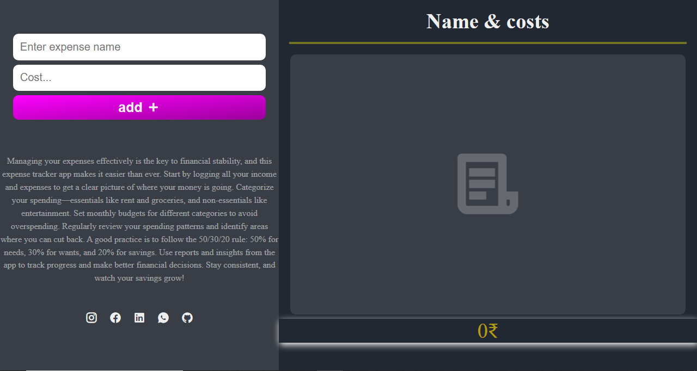

# 💸 Expense Tracker

A simple and clean Expense Tracker web application to help you manage your expenses efficiently. Add, track, and delete your expenses, and keep a real-time view of your total spending. All data is stored in your browser using `localStorage`.

## 🚀 Features

- Add new expenses with name and cost
- Real-time calculation of total expenses
- Remove individual expenses
- Persistent storage using `localStorage`
- Responsive and visually appealing UI
- Minimal, lightweight, and beginner-friendly project

## 🛠️ Tech Stack

- HTML
- CSS
- JavaScript (Vanilla)
- `localStorage` for saving data

## 📸 Preview



## 📂 Project Structure


├── index.html # Main HTML file
├── style.css # Stylesheet
├── app.js # JavaScript logic
├── .gitignore # Files to be ignored by Git
└── README.md # Project info


## 🧪 How to Use

1. Clone the repository:

   ```bash
   git clone https://github.com/yourusername/expense-tracker.git
   cd expense-tracker
   ```
2. Open index.html in any modern web browser.

3. Start adding your expenses and watch your total update in real-time.

📌 Best Practices Followed
    Separation of concerns (HTML, CSS, JS in different files)

    ```<ul>
    <li>Input validation</li>
    <li>Data persistence with localStorage</li>
    <li>Mobile-friendly layout</li>
    ```</ul>

💡 Future Improvements (Optional)

    Filter or categorize expenses
    Add income tracking
    Export/Import data
    Add dark/light theme toggle


Made with ❤️ by Anwar Hussain